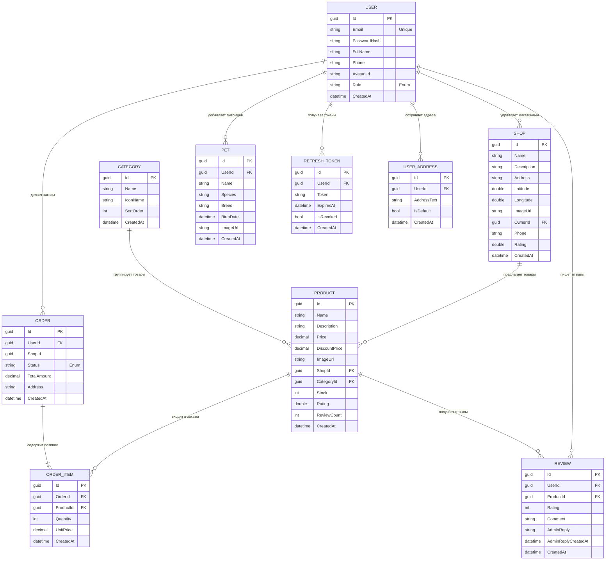

# Схема базы данных проекта «Pawora»

На этой странице представлена интерактивная диаграмма сущностей (Entity Relationship Diagram) базы данных PostgreSQL проекта «Pawora».

### Описание связей
* **Пользователи (`USER`):** Является центральной сущностью. Связан «один-ко-многим» с заказами, отзывами, питомцами, адресами доставки и рефреш-токенами. Также пользователь с ролью `Admin` может владеть магазинами.
* **Магазины (`SHOP`):** Владельцем магазина является пользователь (связь с `USER`). В магазине продаются товары (связь «один-ко-многим» с `PRODUCT`).
* **Товары (`PRODUCT`):** Обязательно принадлежат магазину (`ShopId`) и категории (`CategoryId`). Товар может содержать отзывы пользователей (`REVIEW`) и входить в различные пункты заказов (`ORDER_ITEM`).
* **Заказы (`ORDER`):** Содержат одну или несколько позиций (`ORDER_ITEM`), которые жестко привязаны к конкретному товару (`ProductId`).
